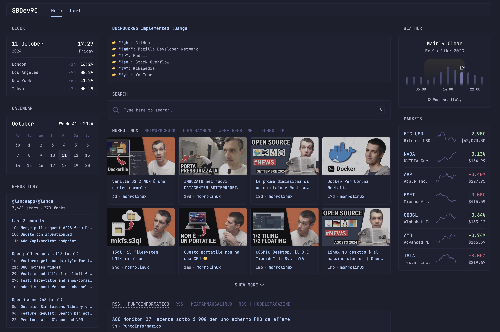

# glance-dashboard
Dev lab dashboard created using **Glanceapp** and **Docker**.
The web service is made up of two parts:
- the actual dashboard (*Docker container with Glance*)
- the http server managing external API requests (*Docker container with Python http server*)


<hr>

[Glance](https://github.com/glanceapp/glance) is a self-hosted dashboard that puts all your feeds in one place.

[Docker](https://www.docker.com/) helps developers build, share, run, and verify applications anywhere — without tedious environment configuration or management.
<hr>

### How to use it
1. Clone the GitHub repo
2. Adjust same widget parameters (ex. location of the weather widget)
3. (Optional) Add/Remove some widget or pages
4. Position yourself in `glance-dashboard/py-http-server` and build the Docker image with the command below:
	```bash
	docker build -t py-http-server .
	```
5. Execute the `docker compose` command below to create the containers composing the Docker stack:
	```bash
	docker compose up -d
	```
6. Visit the url `http://localhost:8888` to access the dashboard
<hr>

### Additional Tips
To create and run individually the two containers that composing the stack, use the below commands respectively:

##### Glance
```bash
docker run -itd -p 8888:8080 \
	-v ./glance/glance.yml:/app/glance.yml \
	-v ./glance/assets/:/app/assets/ \
	-v /etc/timezone:/etc/timezone:ro \
	-v /etc/localtime:/etc/localtime:ro \
	--name glance \
	--restart unless-stopped \
	glanceapp/glance:latest
```
Note: *every time you edit the `glance.yml` or the `my-style.css` for the dashboard content, layout or style you have to recreate the containers stack with the `docker compose` command.*

##### Glance Extensions Server
```bash
docker run -itd -p 12345:12345 \
	--name glance-extensions-server \
	--restart unless-stopped \
	py-http-server
```

Note: *every time you edit the `app.py` or the `Dockerfile` for the http server logic you have to rebuild the Docker image and recreate the containers stack with the `docker compose` command.*
<hr>

### Credits
Feel free to use and edit this web service but it would be appreciated if you follow and visit the original repo and contributors at [Glance](https://github.com/glanceapp/glance).

Note: *every API used and eventually used from the http server that manage the Glance "extensions" has its own license and terms of use.*
